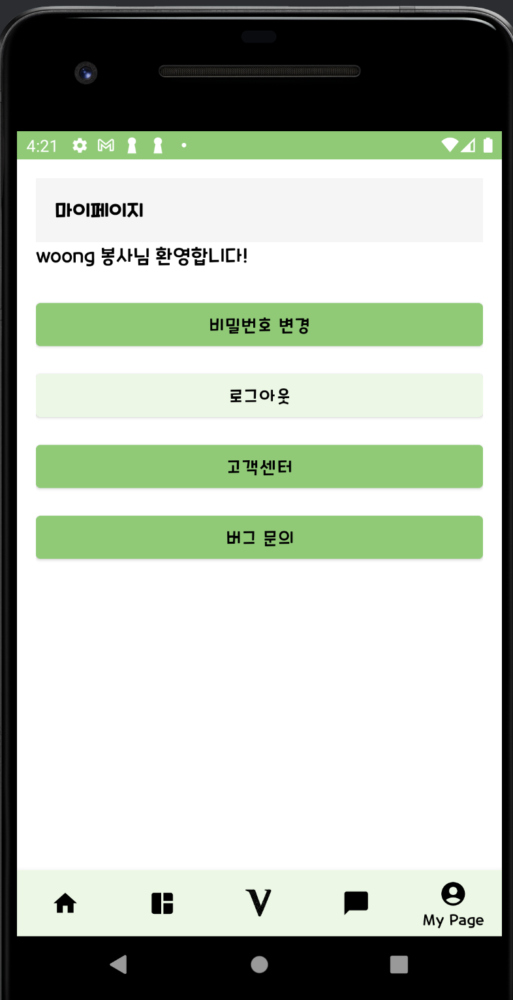

# VolunteeerKim

 
이름 : 김봉사 
나이 : 31 
직업 : 무직  
봉사 : 345시간

# 🧐 Kinbongsa
봉사메이트가 필요할 때, 봉사후기가 궁금할 때, 봉사관련 정보를 한 곳에서 Kimbongsa:  
"숭실대학교 사용자인터페이스 및 실습 프로젝트"

  
## 💚 Overview
봉사활동 정보를 효율적으로 관리하고 공유하며, 커뮤니티로 사람들을 연결해 봉사활동 참여를 돕는 종합 서비스

## 💚 사용해보고 싶다면?
🔗 [Kimbongsa](https://kimbongsa.kr/)

## 💚 팀원 소개
||||
|:---:|:---:|:---:|
|숭실대학교|숭실대학교|숭실대학교|
|김성혁|손영웅|추교준|
|[@leegh1025](https://github.com/leegh1025)|[@hander0](https://github.com/hander0)|[@wldy4627](https://github.com/wldy4627)|[@jihunjourney](https://github.com/jihunjourney)|[@yumin22](https://github.com/yumin22)|

## 🛠️ Tech
[JAVA]  [FIREBASE]

## 💚 서비스 소개
저희 앱‘김봉사’는 단순한 봉사활동 커뮤니티를 넘어 봉사활동에 대한 정보를
효율적으로 관리하고 공유할 수 있는 서비스 입니다. 공공기관 서비스를 제외하고
봉사활동에 대해서 여러 사람들이 얘기를 나누고 정보를 공유할 수 있는 서비스의
부재를 느껴 다소 딱딱하고 불편하고 제한적인 공공기관의 서비스와 차별점을 둔
서비스를 기획하였습니다. 또한 저희 앱의 차별점은 커뮤니티를 통해 여러 사람들을
이어준다는 것입니다. 커뮤니티에서 봉사 메이트를 구하고, 봉사자를 구하는 활동도
할 수 있으며 댓글 및 채팅기능을 통해 서로 대화도 할 수 있습니다. 그 외에도
유형별 봉사시간 그래프, 봉사 군가산점 계산기, 헌혈 기간 알림이, 봉사 달력, 봉사
랭킹, 봉사 추천 등 여러 부가적인 기능도 제공하고 있습니다. 이러한한 다양한
기능을 통해 사용자들이 봉사활동에 더욱 적극적으로 참여할 수 있도록 돕고자
합니다. 

## 💚 기능 소개
|  **로그인 화면** |  **홈 화면** |  **봉사 시간** |
|---------------------------------------------|------------------------------------------|------------------------------------------|
|  **봉사 달력e** |  **봉사 랭킹** |  **봉사 추천** |
|  **커뮤니티** |  **리뷰 작성** |  **C채팅 회면** |
|  **채팅 목록** |  **마이페이지** |                                          |

